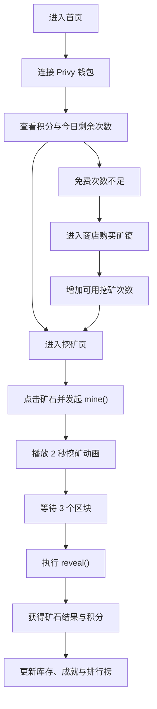

## 1. 产品概述
Block Ore 是一个部署在 Base 链上的轻量级链上挖矿小游戏，用户通过每日挖矿、购买矿镐与收集矿石获得积分和稀有 NFT。
- 核心目标是提升 Base 链活跃度、提高 Base App 用户留存，并通过矿镐销售形成可持续收入。
- 产品面向移动端优先用户，强调低门槛、即时反馈、链上可验证和可分享的轻游戏体验。

## 2. 核心功能

### 2.1 用户角色
| 角色 | 接入方式 | 核心权限 |
|------|----------|----------|
| 普通玩家 | Privy 钱包登录 | 挖矿、Reveal、查看积分、查看排行榜、购买矿镐、领取 NFT |

### 2.2 功能模块
1. **首页**：玩家状态总览、核心入口、链上战绩摘要。
2. **挖矿页**：矿石点击挖矿、等待区块解析、Reveal 结果展示、奖励反馈。
3. **矿石与成就页**：矿石库存、NFT 展示、成就解锁进度、分享战绩。
4. **排行榜页**：Top 10、Top 100、Top 1000 排名切换，积分与矿石数据展示。
5. **商店弹层/页面**：矿镐购买、价格说明、剩余每日可购买次数提示。

### 2.3 页面详情
| 页面名称 | 模块名称 | 功能说明 |
|-----------|-----------|-----------|
| 首页 | 顶部品牌区 | 展示 Block Ore Logo、Base 网络状态、登录入口 |
| 首页 | 玩家数据卡 | 展示当前积分、今日剩余次数、累计挖矿次数、今日上限进度 |
| 首页 | 快捷操作区 | 提供开始挖矿、我的矿石、排行榜三个主入口 |
| 首页 | 今日情报区 | 展示矿石概率、创世矿剩余量、近期链上战绩摘要 |
| 挖矿页 | 矿石主视觉区 | 点击矿石立即触发 2 秒挖矿动画，动画期间禁止重复提交 |
| 挖矿页 | Reveal 流程区 | 动画结束后显示“正在解析区块...”，待满足区块条件后可 Reveal |
| 挖矿页 | 结果面板 | 展示矿石等级、积分奖励、是否可铸造 NFT、是否触发成就 |
| 挖矿页 | 状态提示区 | 展示请求区块、等待区块数、交易状态、失败与重试提示 |
| 矿石与成就页 | 矿石仓库 | 按 Stone、Iron、Silver、Gold、Diamond、Genesis 展示数量 |
| 矿石与成就页 | NFT 展示区 | 展示 Diamond NFT、Genesis NFT 与可领取状态 |
| 矿石与成就页 | 成就系统 | 展示矿工成就列表、完成条件与当前进度 |
| 排行榜页 | 排名切换 | 支持 Top 10、Top 100、Top 1000 切换与当前用户定位 |
| 排行榜页 | 排行榜列表 | 展示钱包缩略、积分、累计挖矿次数、稀有矿石数量 |
| 商店页 | 矿镐卡片 | 展示普通/高级/钻石矿镐价格、获得次数、每日可购买说明 |
| 商店页 | 购买反馈 | 展示钱包确认、支付成功、剩余可购买次数与失败提示 |

## 3. 核心流程
玩家进入首页后完成钱包登录，查看今日剩余挖矿次数并点击开始挖矿。进入挖矿页后点击矿石触发链上 `mine()` 请求，等待 3 个区块后执行 `reveal()` 获取矿石结果与积分；若结果为 Diamond 或 Genesis，则同步触发 NFT 领取或铸造提示。用户可在矿石页查看库存、NFT 与成就进度，并在排行榜页查看全站积分排名；当免费次数不足时，可在商店购买矿镐补充次数。

## 4. 用户界面设计
### 4.1 设计风格
- 设计方向：移动端优先的链上矿洞仪表盘，视觉关键词为“熔岩金属、深空矿脉、霓虹扫描”。
- 主色：深曜黑 `#090B12`、矿岩灰 `#171B27`；强调色：电蓝 `#4DA8FF`、熔金 `#F9B84E`。
- 按钮风格：大圆角、半透明磨砂、带内发光与按压缩放反馈。
- 字体策略：标题使用有机械感的展示字体，正文使用清晰的无衬线字体；数字采用等宽风格增强仪表盘感。
- 布局风格：最大宽度 430px，居中显示，桌面端仅等比放大，不引入侧栏。
- 图标建议：矿石、矿镐、闪电、奖杯、星图等轻拟物图标。

### 4.2 页面设计概览
| 页面名称 | 模块名称 | UI 元素 |
|-----------|-----------|-----------|
| 首页 | 顶部品牌区 | 发光 Logo、链上状态点、磨砂头部栏 |
| 首页 | 玩家数据卡 | 多层渐变卡片、数字翻牌动画、进度环 |
| 首页 | 快捷操作区 | 大尺寸主按钮、双列快捷卡片、轻微浮动动效 |
| 挖矿页 | 矿石主视觉区 | 居中矿石、光晕粒子、点击碎裂动画、震动反馈 |
| 挖矿页 | Reveal 流程区 | 时间轴、区块计数、状态标签、等待脉冲动画 |
| 矿石与成就页 | 仓库列表 | 稀有度分层卡片、数量徽标、NFT 边框光效 |
| 排行榜页 | 榜单区域 | 高亮前三名、滚动列表、当前用户悬浮定位 |
| 商店页 | 矿镐商品卡 | 金属材质卡片、价格标签、剩余额度提示 |

### 4.3 响应式策略
- 以移动端为首要设计目标，优先适配 390px 至 430px 宽度设备。
- 桌面端保持单列结构，仅扩大卡片、间距和阴影层次，不改变交互路径。
- 所有关键交互需兼容触控点击，动效持续时间控制在 200ms 至 2000ms 范围内。

### 4.4 动效与沉浸感指引
- 挖矿主视觉需具备矿石呼吸光效、点击冲击波与碎屑粒子。
- Reveal 阶段使用区块扫描线、数字滚动与稀有度发光登场动效。
- 稀有矿石和 NFT 展示使用更强的光晕、描边和闪烁粒子，形成奖励高潮。
- 成就解锁时采用轻量庆祝动画，避免过度遮挡主操作流程。
