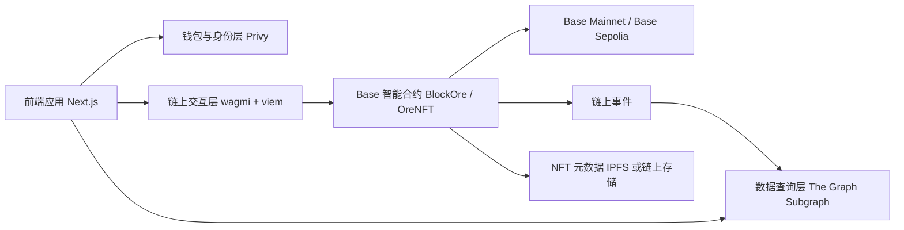
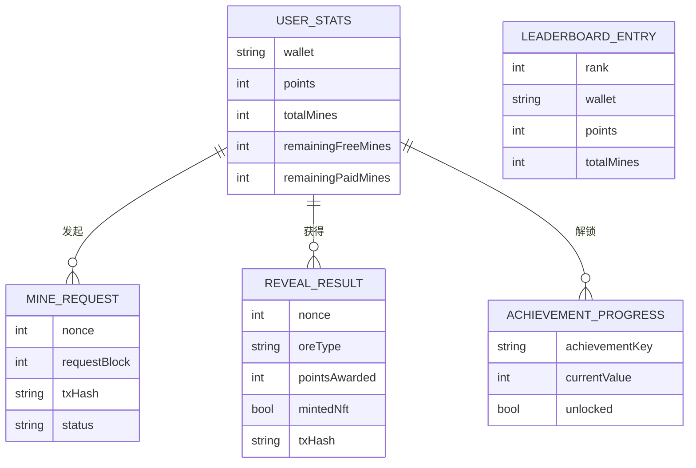

## 1. 架构设计



## 2. 技术说明

* 前端：Next.js 最新稳定版 + React 18 + TypeScript + Tailwind CSS + shadcn/ui

* 状态管理：Zustand
- 钱包与登录：Privy，兼容 Base Wallet、Coinbase Wallet、Smart Wallet、Email Wallet
- 链上交互：wagmi + viem，前端本地开发默认连接 Base Sepolia，生产部署默认连接 Base Mainnet

* 动效：framer-motion + lottie-react

- Monorepo：根目录使用 workspaces 管理 `apps/*`、`packages/*`，`contracts/` 独立维护 Foundry 工程

## 3. 路由定义

| 路由           | 作用                       |
| ------------ | ------------------------ |
| /            | 首页，展示玩家总览与核心入口           |
| /mine        | 挖矿页面，执行 mine 与 reveal 流程 |
| /inventory   | 我的矿石与成就页                 |
| /leaderboard | 排行榜页面                    |
| /shop        | 矿镐商店页面                   |

## 4. API 定义

本项目 MVP 阶段不引入传统后端 API，所有数据来源分为两类：

### 4.1 客户端合约读写接口

```ts
type MineRequest = {
  user: `0x${string}`;
};

type MineResponse = {
  requestBlock: number;
  nonce: number;
  txHash: `0x${string}`;
};

type RevealRequest = {
  user: `0x${string}`;
  nonce: number;
};

type RevealResponse = {
  oreType: "STONE" | "IRON" | "SILVER" | "GOLD" | "DIAMOND" | "GENESIS";
  pointsAwarded: number;
  mintedNft: boolean;
  txHash: `0x${string}`;
};

type UserStats = {
  points: number;
  totalMines: number;
  remainingFreeMines: number;
  remainingPaidMines: number;
  oreCounts: Record<"STONE" | "IRON" | "SILVER" | "GOLD" | "DIAMOND" | "GENESIS", number>;
};
```

### 4.2 Subgraph 查询结果

```ts
type LeaderboardEntry = {
  wallet: string;
  points: number;
  totalMines: number;
  diamondCount: number;
  genesisCount: number;
  rank: number;
};

type ActivityFeedItem = {
  wallet: string;
  oreType: string;
  pointsAwarded: number;
  createdAt: string;
};
```

## 5. 服务架构说明

MVP 采用“纯前端 + 合约 + Subgraph”方案，不设置独立业务服务端：

* 前端直接连接钱包，向 Base 合约发起交易或读取合约状态。
- 钱包与链环境通过环境变量驱动，未显式配置时开发环境默认走 `Base Sepolia`，生产环境默认走 `Base Mainnet`。

## 6. 数据模型

### 6.1 数据模型定义



### 6.2 前端状态结构

```ts
type GameSessionState = {
  currentWallet?: `0x${string}`;
  latestMine?: {
    nonce: number;
    requestBlock: number;
    status: "idle" | "pending" | "waiting" | "revealable" | "revealing" | "done" | "failed";
  };
  stats?: UserStats;
  inventoryModalOpen: boolean;
  shopOpen: boolean;
  selectedLeaderboardTab: "TOP_10" | "TOP_100" | "TOP_1000";
};
```

## 7. 实现原则

* 保持移动端优先，最大内容宽度锁定 430px。

* 不接入中心化数据库，不引入服务端账号体系。
- 使用 adapter 层同时兼容真实链上读写与本地 mock；当未配置 Privy App ID、合约地址或 RPC 时，界面仍可退回本地演示模式。
- `contracts/` 目录按 Foundry 标准结构维护，包含 `src/`、`script/`、`test/` 与 `foundry.toml`。
- 根目录结构目标如下：

```text
block-ore/
├── apps/
│   └── web/
├── contracts/
├── packages/
│   ├── config/
│   └── ui/
├── subgraph/
└── docs/
```

* 开发问题 [Base Docs](https://docs.base.org/)
